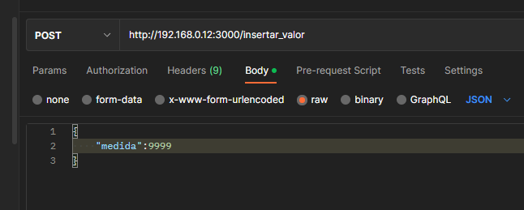
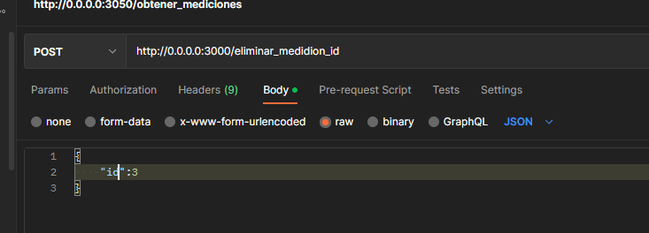
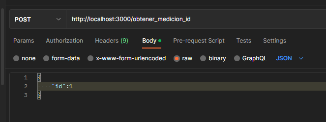

# Backend

## Instalación

- Primero es necesario tener instalado Docker en el sistema, se puede descargar de la página oficial
https://docs.docker.com/desktop/install/windows-install/

- Moverse en el terminal  a la carpeta backend y ejecutar el comando `npm install` seguido de este ejecutaremos `docker-compose up --build` para inicializar los contenedores tanto del servidor como de la base de datos

## Funcionamiento

### Endpoints de la app :

- `/insertar_valor` tipo `POST`, esta función inserta un valor nuevo en la base de datos al recibir la información en el siguiente formato 

- `/obtener_mediciones` tipo `GET`, esta función obtiene todas las mediciones de la base de datos

- `/eliminar_medicion_id` tipo `POST`, esta función elimina un valor nuevo en la base de datos al recibir la información en el siguiente formato 

- `/obtener_medicion_id` tipo `POST`, esta función obtiene  una medición en concreto al recibir información en el siguiente formato 